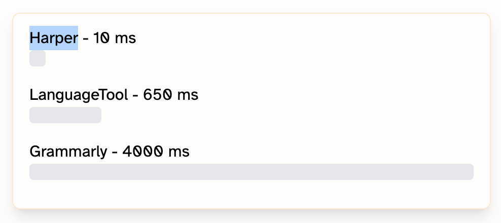

Luiz recentemente recebeu uma recomendação sobre [Harper](https://writewithharper.com/), uma nova ferramenta de verificação gramatical desenvolvida pela [Automattic](https://automattic.com/) usando Rust.

O repositório do projeto descreve Harper como atendendo aos requisitos específicos do desenvolvedor: ele é o verificador gramatical que atende às necessidades, analisando documentos em milissegundos com um consumo mínimo de memória.

## Características principais

- **Desempenho rápido:** análise em nível de milissegundos
- **Baixo consumo de memória:** menos de 1/50 do uso do LanguageTool
- **Privacidade completa:** funciona localmente, sem enviar dados para servidores
- **Compatibilidade com WebAssembly:** pode ser executado em múltiplas plataformas

## Instalação

A instalação é simples através das lojas de extensões para:

- Navegadores web
- Visual Studio Code
- Obsidian

Para outras plataformas, documentação abrangente está disponível em [writewithharper.com/docs/about](https://writewithharper.com/docs/about).

## Links úteis

- [Site Oficial - Harper](https://writewithharper.com/)
- [Repositório no GitHub](https://github.com/Automattic/harper)
- [Documentação Oficial](https://writewithharper.com/docs/about)
