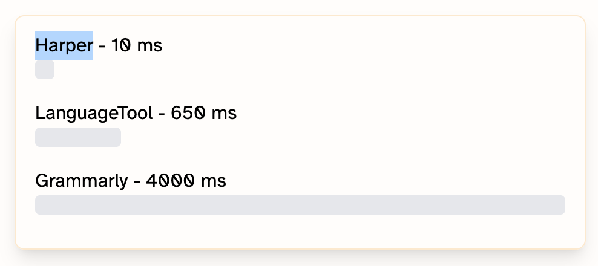

Luiz recently received a recommendation about [Harper](https://writewithharper.com/), a new grammar checking tool developed by [Automattic](https://automattic.com/) using Rust.

The project's repository describes Harper as meeting the developer's specific requirements: it is the grammar checker that meets your needs, analyzing documents in milliseconds with minimal memory usage.

## Key features

- **Fast performance:** millisecond-level analysis
- **Low memory usage:** less than 1/50 of LanguageTool's usage
- **Complete privacy:** runs locally, without sending data to servers
- **WebAssembly compatibility:** can run on multiple platforms

## Installation

Installation is simple through the extension stores for:

- Web browsers
- Visual Studio Code
- Obsidian

For other platforms, comprehensive documentation is available at [writewithharper.com/docs/about](https://writewithharper.com/docs/about).

## Useful links

- [Official Site - Harper](https://writewithharper.com/)
- [GitHub Repository](https://github.com/Automattic/harper)
- [Official Documentation](https://writewithharper.com/docs/about)
