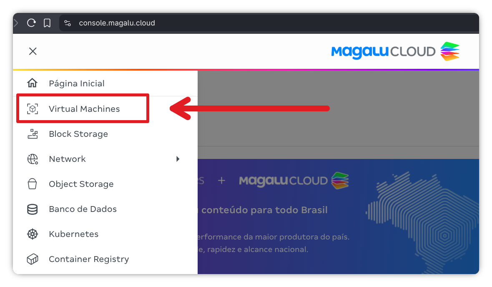
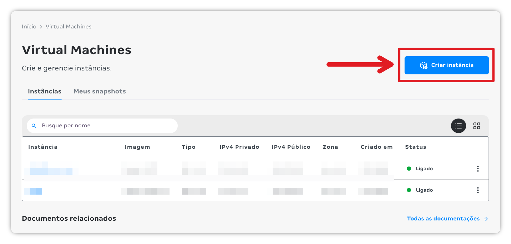
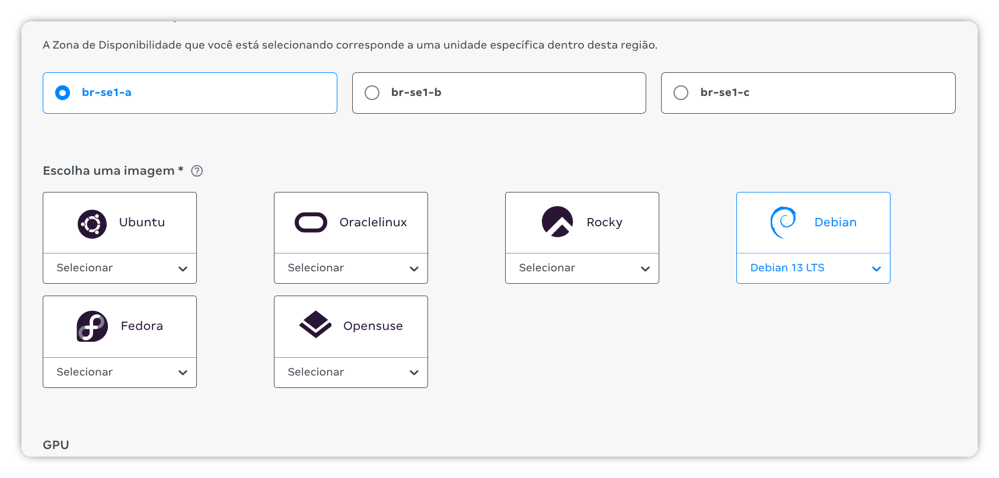
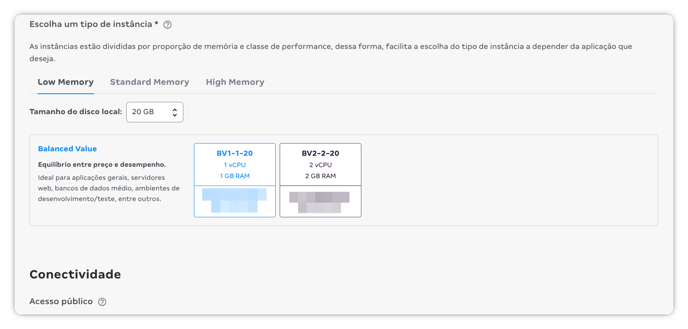
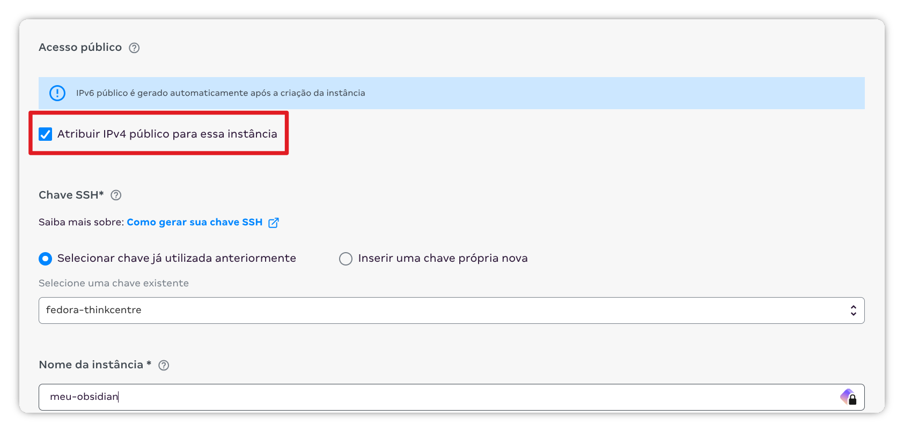

There are several ways to sync Obsidian, but I decided to document the method I chose, both so I don't forget the details in the future and to help anyone else looking for their own sync solution.

For this project, we'll use the Obsidian LiveSync plugin:

[vrtmrz/obsidian-livesync](https://github.com/vrtmrz/obsidian-livesync)

## Creating a VPS on MagaluCloud

For the server, I'll create a VPS on [MagaluCloud](https://magalu.cloud/?ref=luizmartins.dev). I'll do the whole process manually, through the console, but it's possible to do everything using the `mgc` (MagaluCloud _cli_).

1. Open the [console](https://console.magalu.cloud/?ref=luizmartins.dev). To create a new virtual machine, click on [Virtual Machines](https://console.magalu.cloud/virtual-machine?ref=luizmartins.dev):



2. On the [Virtual Machines](https://console.magalu.cloud/virtual-machine?ref=luizmartins.dev) page, click **Create Instance**:



3. Select the desired Availability Zone (in this example, I chose br-se1-a) and also the Operating System. Here I'll go with Debian 13 LTS:



For the server, we can go with the cheapest option! I chose the instance with 1 vCPU and 1 GB of RAM (BV1-1-20). The only detail is storage; for safety, I chose a 20 GB local disk.



Don't forget to leave the option checked to assign a public IPv4 address to the instance. To access the machine, select an existing SSH key (if you already have one). Otherwise, add a new public key. If you don't have one yet, the documentation can help. Keep the generated keys safe, because losing them will prevent access to the machine! Finally, give the instance a descriptive name and click Create instance.



## Configuring the server

Access the newly created server with ssh:

```bash
ssh debian@your-ip-here.com
```

For this project, we'll need Docker installed. The installation steps were taken from the project's documentation. Run each command below individually to add Docker's repository to your server:

```bash
# Add Docker's official GPG key:
sudo apt update
sudo apt install ca-certificates curl
sudo install -m 0755 -d /etc/apt/keyrings
sudo curl -fsSL https://download.docker.com/linux/debian/gpg -o /etc/apt/keyrings/docker.asc
sudo chmod a+r /etc/apt/keyrings/docker.asc

# Add the repository to Apt sources:
sudo tee /etc/apt/sources.list.d/docker.sources <<EOF
Types: deb
URIs: https://download.docker.com/linux/debian
Suites: $(. /etc/os-release && echo "$VERSION_CODENAME")
Components: stable
Signed-By: /etc/apt/keyrings/docker.asc
EOF

sudo apt update
```

After adding Docker's official repository with the commands above, install the necessary tools:

```bash
sudo apt install docker-ce docker-ce-cli containerd.io docker-buildx-plugin docker-compose-plugin
```

With Docker installed, create a directory to separate your data and configuration:

```bash
mkdir -p ~/obsidian-livesync/{couchdb-data,config}
cd ~/obsidian-livesync
```

Create the file `~/obsidian-livesync/config/local.ini` and add the following configuration:

```ini
[couchdb]
single_node=true
max_document_size = 50000000 ; 50MB (Adjust based on your note size needs)

[chttpd]
require_valid_user = true
max_http_request_size = 4294967296 ; 4GB (Necessary for large sync batches)
enable_cors = true

[chttpd_auth]
require_valid_user = true
authentication_redirect = /_utils/session.html

[httpd]
WWW-Authenticate = Basic realm="administrator"
enable_cors = true

[cors]
origins = app://obsidian.md,capacitor://localhost,http://localhost
credentials = true
headers = accept, authorization, content-type, origin, referer
methods = GET, PUT, POST, HEAD, DELETE
max_age = 3600
```

To install CouchDB, we'll use a docker compose:

```yaml
version: '3.8'

services:
  couchdb:
    image: couchdb:latest
    container_name: livesync-couchdb
    restart: always
    environment:
      - COUCHDB_USER=admin
      - COUCHDB_PASSWORD=YOUR_STRONG_PASSWORD_HERE
    volumes:
      - ./couchdb-data:/opt/couchdb/data
      - ./config/local.ini:/opt/couchdb/etc/local.d/local.ini
    ports:
      - "127.0.0.1:5984:5984" # Expose only to localhost, Caddy handles external traffic

  caddy:
    image: caddy:latest
    container_name: livesync-caddy
    restart: always
    ports:
      - "80:80"
      - "443:443"
    volumes:
      - ./Caddyfile:/etc/caddy/Caddyfile
      - caddy_data:/data
      - caddy_config:/config
    depends_on:
      - couchdb

volumes:
  caddy_data:
  caddy_config:
```

Don't forget to change your database password in the file above. Choose a strong password!

To handle the reverse proxy and digital certificate, we'll use Caddy. Create the file `~/obsidian-livesync/Caddyfile` and add the following configuration, adjusting the domain:

```
obsidian.yourdomain.com {
    reverse_proxy couchdb:5984
}
```

Bring the stack up with:

```bash
docker compose up -d
```

Now let's create a database called obsidian. You're free to use any name here:

```bash
curl -X PUT -u admin http://127.0.0.1:5984/obsidian
```

Enter the username and password defined in the file `~/obsidian-livesync/config/local.ini`.

## Configuring the client

Install the Self-hosted LiveSync Plugin after enabling Community Plugins.

**Setup Wizard:**

1. Open the Plugin Settings
2. Select Remote Database Configuration
3. Configure the following fields:
   - **URI:** https://obsidian.yourdomain.com
   - **Username:** admin
   - **Password:** YOUR_STRONG_PASSWORD_HERE
   - **Database Name:** obsidian
   - **End-to-End Encryption:** Enabled (Recommended! A new password will be used for encryption!)
4. Test: Click "Test Connection". If successful, apply the settings.
