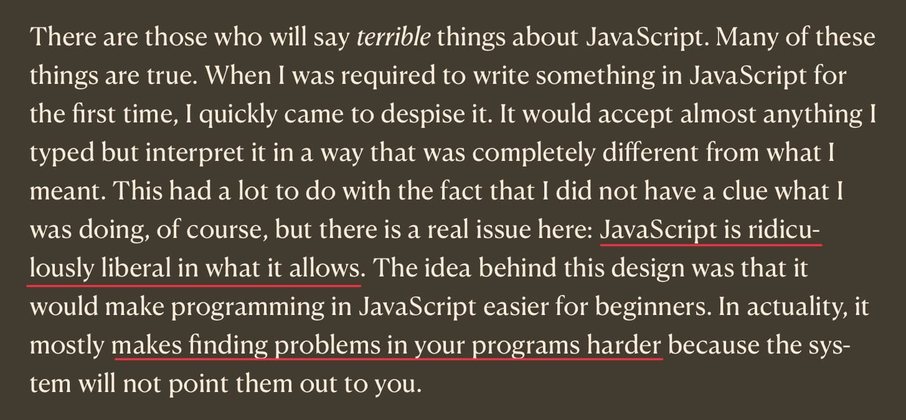

JavaScript is a remarkably permissive language, which can be both a blessing and a curse for developers. This post explores the liberal aspects of the language and its implications for code quality and developer experience.
