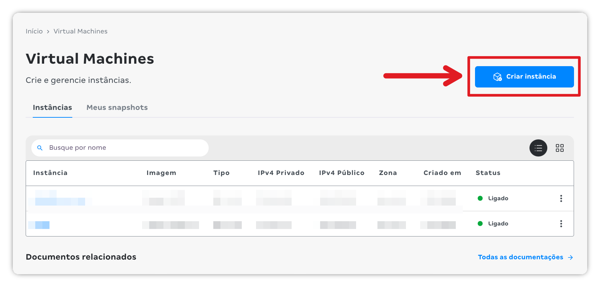
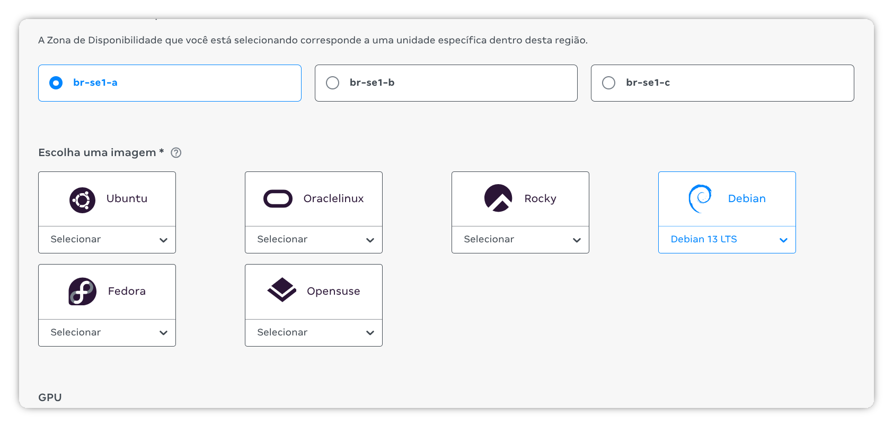
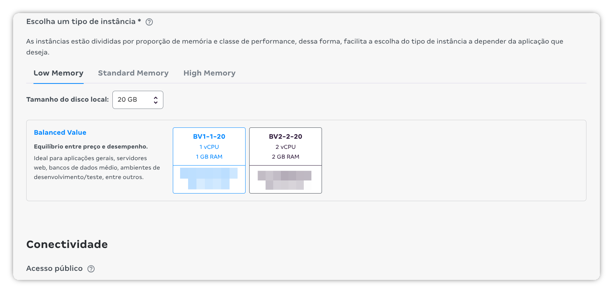
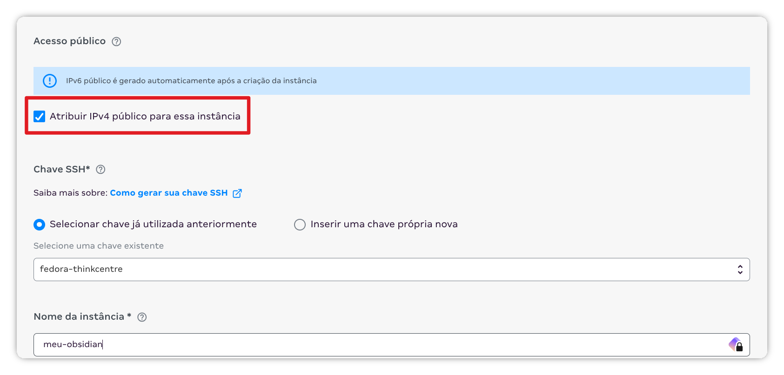

Existem várias formas de sincronizar o Obsidian, mas decidi documentar o método que escolhi, tanto para não esquecer os detalhes no futuro quanto para ajudar quem também busca uma solução própria de sincronização.

Para esse projeto, usaremos o plugin Obsidian LiveSync:

[vrtmrz/obsidian-livesync](https://github.com/vrtmrz/obsidian-livesync)

## Criando uma VPS no MagaluCloud

Para o servidor, criarei uma VPS no [MagaluCloud](https://magalu.cloud/?ref=luizmartins.dev). Vou fazer o mesmo processo de forma manual, pelo console, mas é possível fazer tudo utilizando o `mgc` (MagaluCloud _cli_).

1. Abra o [console](https://console.magalu.cloud/?ref=luizmartins.dev). Para criar uma nova máquina virtual, clique em [Virtual Machines](https://console.magalu.cloud/virtual-machine?ref=luizmartins.dev):


2. Na página de [Virtual Machines](https://console.magalu.cloud/virtual-machine?ref=luizmartins.dev), clique em **Criar Instância**:



3. Selecione a Zona de Disponibilidade desejada (nesse exemplo, escolhi a br-se1-a) e também o Sistema Operacional. Aqui vou de Debian 13 LTS:



Para o servidor, podemos ir com a opção mais barata! Escolhi a instância com 1 vCPU e 1 GB de RAM (BV1-1-20). O único detalhe é o espaço; por segurança, escolhi um disco local de 20 GB.



Não se esqueça de deixar marcada a opção para atribuir endereço de IPv4 público para a instância. Para acessar a máquina, selecione uma chave SSH existente (se já tiver uma). Do contrário, insira uma chave pública nova. Se não ainda não tiver uma, a documentação pode ajudar. Guarde as chaves geradas com cuidado, pois perdê-las impedirá o acesso à máquina! Por fim, dê um nome ilustrativo à instância e clique em Criar instância.



## Configurando o servidor

Acesse o servidor recém criado com ssh:

```bash
ssh debian@seu-ip-aqui.com
```

Para esse projeto, precisaremos do Docker instalado. O passo a passo de instalação foi retirado da documentação do projeto. Rode individualmente cada comando abaixo para adicionar o repositório do Docker ao seu servidor:

```bash
# Add Docker's official GPG key:
sudo apt update
sudo apt install ca-certificates curl
sudo install -m 0755 -d /etc/apt/keyrings
sudo curl -fsSL https://download.docker.com/linux/debian/gpg -o /etc/apt/keyrings/docker.asc
sudo chmod a+r /etc/apt/keyrings/docker.asc

# Add the repository to Apt sources:
sudo tee /etc/apt/sources.list.d/docker.sources <<EOF
Types: deb
URIs: https://download.docker.com/linux/debian
Suites: $(. /etc/os-release && echo "$VERSION_CODENAME")
Components: stable
Signed-By: /etc/apt/keyrings/docker.asc
EOF

sudo apt update
```

Depois de adicionar o repositório oficial do Docker com os comandos acima, instale as ferramentas necessárias:

```bash
sudo apt install docker-ce docker-ce-cli containerd.io docker-buildx-plugin docker-compose-plugin
```

Com o Docker instalado, crie um diretório para separar seus dados e configurações:

```bash
mkdir -p ~/obsidian-livesync/{couchdb-data,config}
cd ~/obsidian-livesync
```

Crie o arquivo `~/obsidian-livesync/config/local.ini` e adicione as seguintes configurações:

```ini
[couchdb]
single_node=true
max_document_size = 50000000 ; 50MB (Adjust based on your note size needs)

[chttpd]
require_valid_user = true
max_http_request_size = 4294967296 ; 4GB (Necessary for large sync batches)
enable_cors = true

[chttpd_auth]
require_valid_user = true
authentication_redirect = /_utils/session.html

[httpd]
WWW-Authenticate = Basic realm="administrator"
enable_cors = true

[cors]
origins = app://obsidian.md,capacitor://localhost,http://localhost
credentials = true
headers = accept, authorization, content-type, origin, referer
methods = GET, PUT, POST, HEAD, DELETE
max_age = 3600
```

Para instalar o CouchDB, usaremos um docker compose:

```yaml
version: '3.8'

services:
  couchdb:
    image: couchdb:latest
    container_name: livesync-couchdb
    restart: always
    environment:
      - COUCHDB_USER=admin
      - COUCHDB_PASSWORD=YOUR_STRONG_PASSWORD_HERE
    volumes:
      - ./couchdb-data:/opt/couchdb/data
      - ./config/local.ini:/opt/couchdb/etc/local.d/local.ini
    ports:
      - "127.0.0.1:5984:5984" # Expose only to localhost, Caddy handles external traffic

  caddy:
    image: caddy:latest
    container_name: livesync-caddy
    restart: always
    ports:
      - "80:80"
      - "443:443"
    volumes:
      - ./Caddyfile:/etc/caddy/Caddyfile
      - caddy_data:/data
      - caddy_config:/config
    depends_on:
      - couchdb

volumes:
  caddy_data:
  caddy_config:
```

Não se esqueça de alterar a senha de seu banco no arquivo anterior. Escolha uma senha forte!

Para lidar com proxy reverso e certificado digital, usaremos o Caddy. Crie o arquivo `~/obsidian-livesync/Caddyfile` e adicione as seguintes configurações, ajustando o domínio:

```
obsidian.yourdomain.com {
    reverse_proxy couchdb:5984
}
```

Suba a stack com:

```bash
docker compose up -d
```

Agora vamos criar um banco de dados chamado obsidian. Você é livre para usar qualquer nome aqui:

```bash
curl -X PUT -u admin http://127.0.0.1:5984/obsidian
```

Entre com o nome de usuário e senha definidos no arquivo `~/obsidian-livesync/config/local.ini`.

## Configurando o cliente

Instale o Plugin Self-hosted LiveSync após ativar os Community Plugins.

**Setup Wizard:**

1. Abra as Plugin Settings
2. Selecione Remote Database Configuration
3. Configure os seguintes campos:
   - **URI:** https://obsidian.yourdomain.com
   - **Username:** admin
   - **Password:** YOUR_STRONG_PASSWORD_HERE
   - **Database Name:** obsidian
   - **End-to-End Encryption:** Enabled (Recomendado! Será usada uma nova senha para encriptação!)
4. Teste: Clique "Test Connection". Se tiver sucesso, aplique as configurações.
